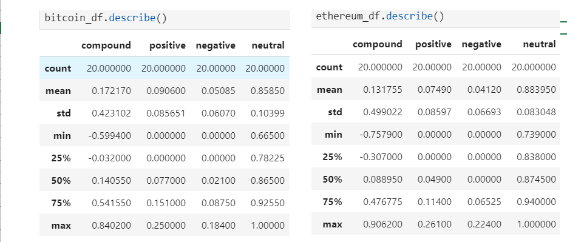
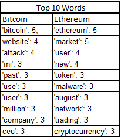

# Natural Language Processing

Cryptocurrency is now a very regular topic in news discussions. In this project, I will analyze the latest news headlines regarding Bitcoin and Ethereum to get a better feel for the current public sentiment around each coin.

I will complete the following tasks:

1. Sentiment Analysis
2. Natural Language Processing
3. Named Entity Recognition

## Data

The "newsapi" was used to fetch the news articles.  The results were saved in  json files, from which dataframes were created to conduct various analyses.

### Sentiments Analysis
A sentiment analysis was performed on both sets of articles, which returned the below results:

 From the descriptive statistics we can see that:
- The coin with the highest mean positive score was bitcoin
-  The coin with the highest compound score was Ethereum.
- The coin with the highest positive score was Ethereum.

### Natural Language Processing

I used NLTK and Python to tokenize the texts for each coin.  From this, the following visualizations were derived:

 (1) the top 10 words for each coin:

 

(2) Word Clouds

Bitcoin Word Cloud

Ethereum Word Cloud

 
Additional analyses which can be found in the accompanying jupyter notebook, included bigrams and a list of the entities and labels related to both sets of articles.